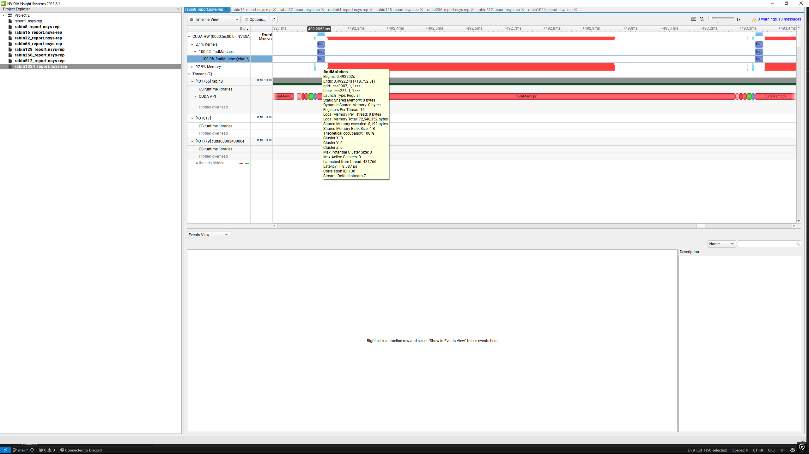

# This folder is for any documents, reports, or images, and anything that doesnt have to do with the algorithms.
---
# How to view Nsys rep
- Open Nsight Systems GUI. You can do it 3 ways:  
  - use your system's search bar, open the nsys-ui.exe on where you installed Nsight Systems
  - open command prompt/terminal/powershell
  - type 'nsys-ui' (wihout apostrophes, and its the esiest way. Just need to specify the .exe in PATH first)
  - Or when on the directory where the nsys rep files are, type 'nsys-ui [your-report-name].nsys-rep'
- File > Open... and choose the rep or sqlite file  
  OR
- Drag the files to the GUI  

# How to view SQLITE
Use any database viewer tools Sqlite viewer such as Sqlite3 or DB Browser...etc.  
We recommend [DB Browser](https://sqlitebrowser.org/). Its only around 20MB and you can choose an installer or zip with the .exe already in it. Open the .exe then just click 'Open Database..' or drag the Sqlite file into the app.  

# How to analyze
- Open 'CUDA HW' > 'Kernels' > select the function name, for example findMatches if its Rabin-Karp CUDA
- Right click the function name (findMatches in this example) and click 'Show in Events View'. This will show you when it started and how long it ran for, and if it actually used GPU
- While the function chosen (highlighted with blue background), zoom in on the timeline on the right until the block is visible. Image below for example in red arrow where to zoom

- Hover over the block, after a short while of hovering, it will show all kinds of information. In this case what we need was execution starting and end time as well as memory usage (check 'nsys example.png' below)

